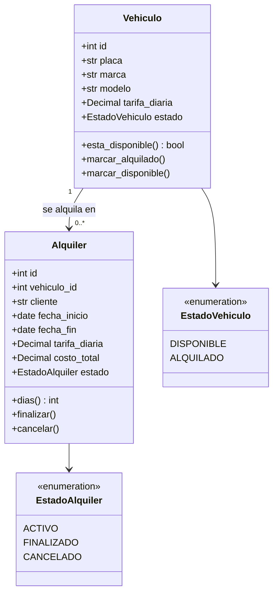
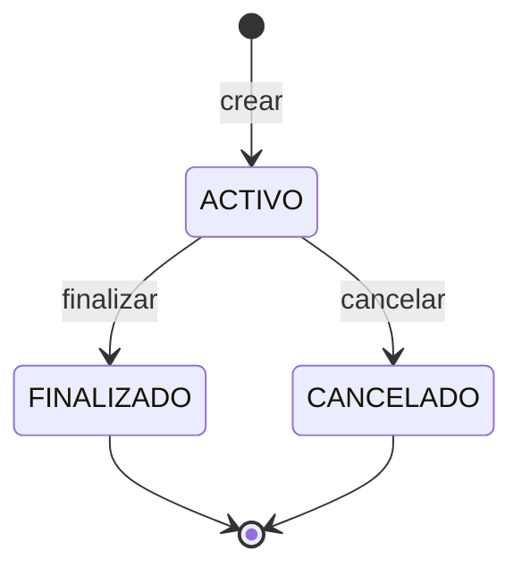

# Diagrama de clases

```mermaid
classDiagram
    class Vehiculo {
        +int id
        +str placa
        +str marca
        +str modelo
        +Decimal tarifa_diaria
        +EstadoVehiculo estado
        +esta_disponible() bool
        +marcar_alquilado()
        +marcar_disponible()
    }
    class Alquiler {
        +int id
        +int vehiculo_id
        +str cliente
        +date fecha_inicio
        +date fecha_fin
        +Decimal tarifa_diaria
        +Decimal costo_total
        +EstadoAlquiler estado
        +dias() int
        +finalizar()
        +cancelar()
    }
    class EstadoVehiculo {
        <<enumeration>>
        DISPONIBLE
        ALQUILADO
    }
    class EstadoAlquiler {
        <<enumeration>>
        ACTIVO
        FINALIZADO
        CANCELADO
    }
    Vehiculo "1" --> "0..*" Alquiler : se alquila en
    Vehiculo --> EstadoVehiculo
    Alquiler --> EstadoAlquiler
```

## Máquina de estados del alquiler

```mermaid
stateDiagram-v2
    [*] --> ACTIVO : crear
    ACTIVO --> FINALIZADO : finalizar
    ACTIVO --> CANCELADO : cancelar
    FINALIZADO --> [*]
    CANCELADO --> [*]
```
